# Hey, I'm Tirth

 
 

Backend engineer and AI systems builder. I work on scalable services, RAG pipelines, and multi-agent systems.

 

### About

M.S. in Computer Science, California State University, Chico. 
3+ years building backend services, data platforms, and agentic AI systems. 
Interested in software development, machine learning, RAG, and LLM systems. 
Co-author of 4 peer-reviewed publications on conversational AI, presented at ASEE Zone 4. 
Open to collaborating on software development projects. 
Reach me at tirthshah.b@gmail.com.

 

### Experience

**Research Assistant** · California State University, Chico · Sep 2024 onward 
RAG pipelines with grounding and evaluation for conversational AI. Cut hallucination rate by 40% on noisy real-world inputs.

**Forward Deployed Software Engineer** · SAP UCC Chico State · May 2024 to May 2026 
RAG-based product discovery agent over 50K+ catalog items for 30+ partners. Real-time notifications with WebSockets and Redis pub/sub, from 2+ hours down to under 500ms.

**Associate Member of Technical Staff** · Onix (formerly Datametica) · Oct 2021 to Jul 2024 
TDD-driven data migration framework for DataStage, Informatica, and Alteryx. Synthetic data pipelines in Groovy and Scala. CI/CD on GitHub Actions and Jenkins. Monolith to microservices migration with Spring Boot, cutting API latency by 80%.

 

### Projects

| Project | What it does | Stack |
|---|---|---|
| **MockMouse** | Multi-agent browser automation. Turns natural language into sandboxed browser actions. Top 3 Dev Tools at Cal Hacks 2025. | Claude, Next.js, FastAPI, WebSockets, Prisma |
| **Déjà Query** | NL-to-SQL agent that reuses compiled query templates, reaching 95% token reuse on repeat questions. | Python, EverOS embeddings, MiniLM |
| **Signal Room** | Multi-agent lead response system with graph memory and a human approval gate. Cut manual triage time by 60%. | FalkorDB, FastAPI, React, Apache Iggy |
| **ChatBook** | RAG system that lets students query their course materials conversationally. | React, Flask, MongoDB Atlas Vector Search |
| **BookMatch** | Hybrid book recommender over 25K titles, with BERT embeddings for cold start. | scikit-learn, BERT, Elasticsearch |

 

### Toolbox

**Languages**&nbsp;&nbsp;

**Frontend**&nbsp;&nbsp;

**Backend**&nbsp;&nbsp;

**AI / ML**&nbsp;&nbsp;

**Databases**&nbsp;&nbsp;

**Cloud & DevOps**&nbsp;&nbsp;

**Data Engineering**&nbsp;&nbsp;

**Version Control**&nbsp;&nbsp;

**Testing**&nbsp;&nbsp;

**Workflow**&nbsp;&nbsp;

 

### Education

**M.S. Computer Science** · California State University, Chico · 2024 to 2026 · GPA 3.96 
**B.E. Electronics and Telecommunication** · Savitribai Phule Pune University · 2018 to 2022 · GPA 3.74
